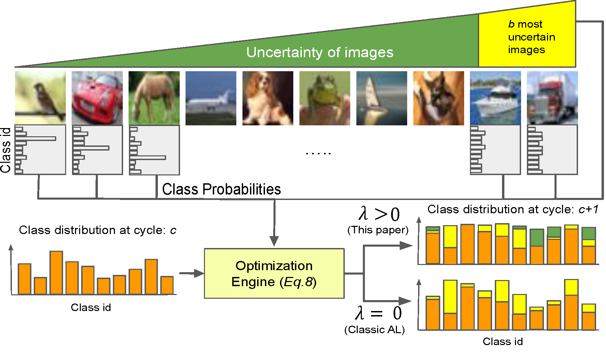

# Class-Balanced Active Learning for Image Classification:

## Description

This repository contains code for the paper Class-Balanced Active Learning for Image Classification:

http://arxiv.org/abs/2110.04543



Bibtex:

### Dependencies
Install Anaconda environment:
https://docs.anaconda.com/anaconda/install/linux/

Install PyTorch :
```
conda install pytorch torchvision torchaudio cudatoolkit=10.2 -c pytorch
```
Install CVXPY python package:
https://www.cvxpy.org/install/

Install Gurobi optimizer and its licenese: 
https://www.gurobi.com/gurobi-and-anaconda-for-linux/


## Getting Started

Before starting AL cycles, execute run_cycl_0.py on cifar10/cifar100 dataset to obtain the imbalance dataset (only once) and train the model on initial sampels:
```
CUDA_VISIBLE_DEVICES=0 python run_cycle_0.py --method RandomSampling --dataset cifar100
```

## Executing program
To run Active Learning cycles use python run.py with the following arguments:

--imb_type (To specify the imbalance type of the dataset)

--imb_factor (To specify the imbalance factor)

--dataset (To specify the dataset)

### Examples:

To run standard EntropySampling method on CIFAR100 dataset and step imbalance and imbalance factor=0.1:
```
CUDA_VISIBLE_DEVICES=0 python run.py --method EntropySampling_imbalance --dataset cifar100 --imb_factor 0.1 --imb_type step
```
To run EntropySampling with optimal class balancing add "optimal" in the method name, for example:
```
CUDA_VISIBLE_DEVICES=0 python run.py --method EntropySampling_optimal --dataset cifar100 --imb_factor 0.1 --imb_type step
```
Other sampling strategies are available by --mehtod argument:
```
CUDA_VISIBLE_DEVICES=0 python run.py --method RandomSampling --dataset cifar100 --imb_factor 0.1 --imb_type step
```

## Contributors
Javad Zolfaghari Bengar (djavad.z@gmail.com)

Laura Lopez Fuentes (lopezfuenteslaura@gmail.com )
